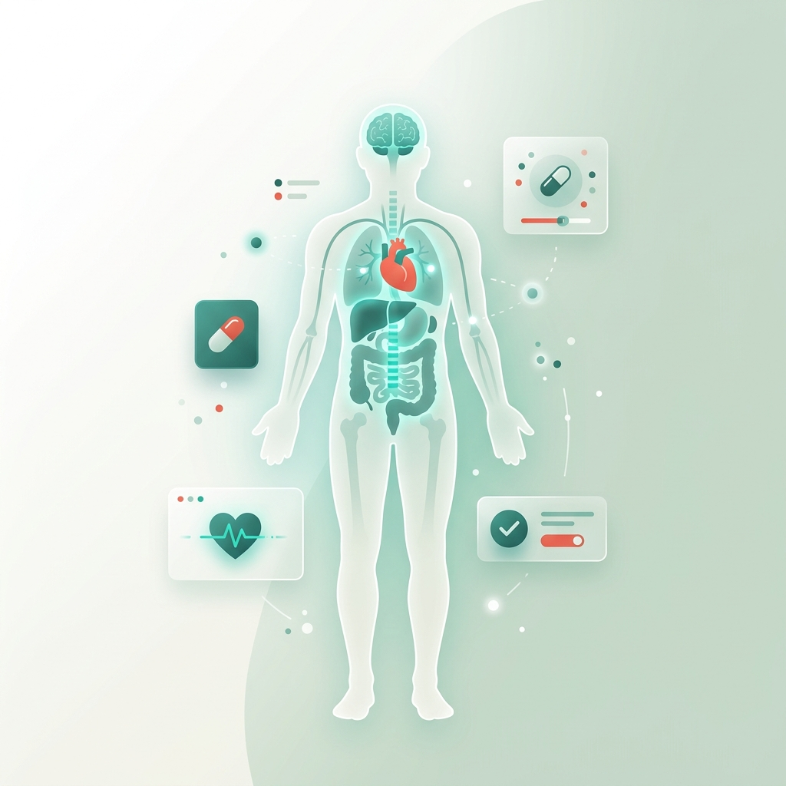

<p align="center">
  
</p>

<h1 align="center">🩺 Salud AI</h1>
<p align="center">
  <b>Zero-Latency, Offline-First Clinical Intelligence for Everyone</b>
</p>

<p align="center">
  
  
  
  
  
</p>

<p align="center">
  <a href="https://akash1458-gg.github.io/Salud-AI/">🌐 Live Demo</a> •
  <a href="#features">✨ Features</a> •
  <a href="#tech-stack">🛠️ Tech Stack</a> •
  <a href="#getting-started">🚀 Getting Started</a>
</p>

---

## 📖 About

**Salud AI** is a privacy-first, offline-capable medical symptom triage engine that runs entirely in the browser. It helps users assess the urgency of their symptoms — from minor aches to life-threatening emergencies — without requiring an internet connection, API keys, or sending any personal health data to external servers.

> ⚠️ **Disclaimer:** Salud AI is a triage assistant, not a diagnostic tool. It does not replace professional medical advice. Always consult a healthcare provider for medical decisions.

---

## ✨ Features

### 🧠 Smart Symptom Triage Engine
- **Interactive 3D Body Map** — Tap where it hurts to load region-specific clinical contexts
- **Severity Assessment** — 5-level severity slider with real-time urgency evaluation
- **Structured Results** — Possible conditions with probability bars, home remedies, and warning signs

### 💊 Comprehensive Treatment Protocols
- **Immediate Actions** — What to do right now
- **24-Hour Care Plans** — Step-by-step recovery guidance
- **OTC Medication Dosages** — Specific drug names, doses, and frequencies
- **Dietary Recommendations** — Foods to eat and avoid for faster recovery
- **Escalation Warning Signs** — When to rush to the hospital

### 🚨 Emergency Response System
- **Auto-Detection** — Triggers on life-threatening symptoms (heart attack, stroke, etc.)
- **Severity Slider Trigger** — Dragging to "Severe" instantly shows the emergency alert
- **Chat Keyword Detection** — Typing emergency terms in chat triggers the ambulance popup
- **One-Tap Ambulance Call** — Pre-configured for Indian emergency services (112 / 108)
- **Nearby Hospital Finder** — Opens Google Maps with "hospitals near me" using device GPS

### 🤖 Context-Aware Offline Chat
- **Stateful Memory** — Remembers your active diagnosis
- **Specific Answers** — Ask "What is the cure?" and get treatment for YOUR condition, not generic advice
- **Keyword Understanding** — Responds intelligently to queries about medications, diet, exercise, sleep, and warning signs

### 📊 Health Dashboard
- **Vitals Logging** — Track blood pressure, blood sugar, and heart rate over time
- **Trend Analysis** — Visual charts showing health trends
- **AI-Powered Insights** — Personalized health recommendations based on logged vitals
- **Health Score** — Dynamic score calculated from your vital readings

### 🔐 Privacy by Architecture
- **Zero Data Collection** — No analytics, no cookies, no tracking
- **No Backend Server** — Everything runs client-side in the browser
- **LocalStorage Only** — All data stays on your device
- **HIPAA-Compliant by Design** — Your health data never leaves your phone

### 🔄 Hybrid AI Mode
- **Offline Default** — Works instantly without any API
- **Optional Cloud AI** — Plug in a Google Gemini API key in Settings to unlock full LLM-powered responses
- **Seamless Switching** — The app automatically uses the best available engine

---

## 📦 Offline Disease Database

Salud AI ships with a pre-built clinical knowledge base covering **20+ conditions** including:

| Category | Conditions |
|----------|-----------|
| 🤒 Respiratory | Flu, COVID-19, Asthma Attack |
| 🧠 Neurological | Migraine, Stroke |
| ❤️ Cardiac | Heart Attack |
| 🤢 Gastrointestinal | Food Poisoning, Appendicitis |
| 💉 Metabolic | Diabetes (High/Low Blood Sugar) |
| 🦠 Infections | UTI, Pink Eye (Conjunctivitis) |
| 🦴 Body Regions | Head, Face, Neck, Chest, Back, Abdomen, Arms, Legs, Hands and Feet |

Each condition includes keywords, severity classification, possible conditions, treatment protocols, OTC medications with dosages, dietary advice, and escalation signs.

---

## 🛠️ Tech Stack

| Layer | Technology |
|-------|-----------|
| **Structure** | HTML5 (Semantic) |
| **Styling** | Vanilla CSS3 (Custom Properties, Grid, Flexbox, Animations) |
| **Logic** | Vanilla JavaScript (ES6+) |
| **Charts** | Custom Canvas-based chart engine |
| **Storage** | Browser LocalStorage |
| **AI (Optional)** | Google Gemini 2.0 Flash API |
| **Hosting** | GitHub Pages |

**Zero dependencies. Zero frameworks. Zero build steps.**

---

## 📁 Project Structure

```
Salud-AI/
├── index.html              # Single-page application entry point
├── hero_art.png            # Hero section artwork
├── css/
│   ├── index.css           # Global styles, hero, layout, responsive
│   ├── components.css      # Buttons, cards, modals, nav, chat UI
│   ├── dashboard.css       # Health dashboard grid and cards
│   └── animations.css      # Keyframe animations (EKG, fade-in, scan)
├── js/
│   ├── app.js              # Main app controller (navigation, modals, profiles)
│   ├── ai-engine.js        # Clinical decision engine + Gemini API integration
│   ├── disease-db.js       # Offline disease database (20+ conditions)
│   ├── symptom-triage.js   # Body map, intake assessment, chat, triage results
│   ├── dashboard.js        # Vitals logging, insights, health score
│   └── charts.js           # Custom canvas chart renderer
└── README.md
```

---

## 🚀 Getting Started

### Option 1: Live Demo
Visit the deployed app: **[https://akash1458-gg.github.io/Salud-AI/](https://akash1458-gg.github.io/Salud-AI/)**

### Option 2: Run Locally
```bash
# Clone the repository
git clone https://github.com/akash1458-gg/Salud-AI.git

# Open in browser (no build step needed!)
cd Salud-AI
open index.html
# Or simply double-click index.html in your file explorer
```

### Option 3: Deploy Your Own
```bash
# Fork this repo, then enable GitHub Pages:
# Settings > Pages > Source: Deploy from branch > Branch: main > Save
# Your app will be live at: https://<your-username>.github.io/Salud-AI/
```

---

## 🎯 How to Use

1. **Open the app** — You'll see the landing page with the hero section
2. **Click "Start Assessment"** — Navigate to the Symptom Check section
3. **Tap a body region** on the interactive body map (or type a symptom manually)
4. **Adjust the severity slider** — Dragging to "Severe" triggers the emergency alert
5. **Click "Analyze Symptoms"** — Answer 3 quick intake questions
6. **View your triage result** — See urgency level, possible conditions, and treatment protocols
7. **Ask follow-up questions** — Type "cure", "medication", "diet", or "warning signs" in the chat
8. **Log vitals** in the Dashboard — Track blood pressure, blood sugar, and heart rate over time

---

## 🤝 Contributing

Contributions are welcome! Feel free to:
- Add new conditions to `js/disease-db.js`
- Improve the clinical decision trees in `js/ai-engine.js`
- Add regional language translations
- Enhance the UI/UX

---

---

## 🙏 Acknowledgments

- Clinical guidelines referenced from **CDC**, **WHO**, **Mayo Clinic**, and **NHS**
- Built with ❤️

---

<p align="center">
  <b>Made with ❤️ in India 🇮🇳</b><br/>
  <i>Empowering patients with instant medical intelligence — offline, private, and free.</i>
</p>
